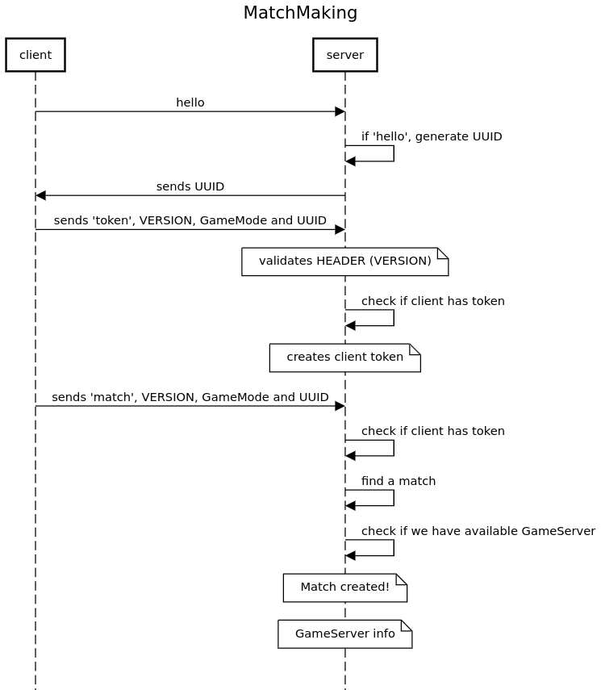

# Go MatchMaking Server

A basic TCP-based MatchMaking server written in Go, designed for handling client connections and facilitating matches between players.

## Features

- **Client Connection Management**: Handles multiple client connections and maintains their state.
- **Message Handling**: Supports different message types: `hello`, `token`, and `match`.
- **UUID Management**: Each client is assigned a unique identifier (UUID) for tracking.
- **Game Mode Support**: Allows players to connect based on game modes.

## Prerequisites

- Go 1.20 or higher
- Basic understanding of Go programming language
- Networking knowledge (TCP/IP)

## Running the Server

Run the server using the following command:

```bash
go run server.go
```

The server will listen for incoming connections on TCP port 5555.

## Client Interaction
The server supports the following messages from clients:

- `hello`: Initiates a connection and retrieves a UUID generated by the server.
- `token`: Asks the server to create a MatchMaking token.
- `match`: Requests a match with another player based on the game mode.

Each message is prefixed with its length. The data is sent in BigEndian byte order.

## Roadmap
- GameMode validation
- figure out how to pass the game server info to the clients: after the match ticket is created (using websockets or keeping this connection open) or publish it somewhere (SQS/DB)
- TLS to encrypt traffic between clients and server (I already did a PoC in Python https://github.com/luciangutu/tls_handshake_poc)
- encrypt the UUID on the server and validate it when I get it back from the client
- support other matches than 1v1


